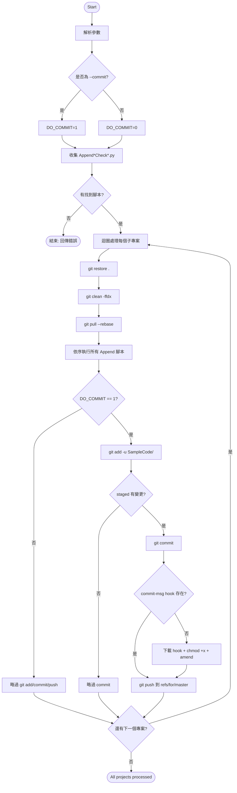

# AutoPR 腳本說明文件

本文件說明主目錄 `AutoPR` 下主要 `.py` / `.sh` 腳本的功能與使用方式。

## 1) Python module installation（快速開始）

### 1.1 基本需求

- Python 3.8+
- Bash（執行 `auto.sh`）
- Git（`auto.sh` 會使用 `git restore/clean/pull/commit/push`）
- `curl`（`auto.sh` 下載 Gerrit `commit-msg` hook）

### 1.2 建議先建立虛擬環境（可選）

```bash
python3 -m venv .venv
source .venv/bin/activate
```

> Windows PowerShell 可改用：
>
> `python -m venv .venv`
>
> `.\.venv\Scripts\Activate.ps1`

### 1.3 使用 requirements 檔安裝（建議）

本資料夾已提供：

- `requirements.txt`

安裝方式：

```bash
python3 -m pip install -r requirements.txt
```

### 1.4 手動安裝（若不使用 requirements）

```bash
python3 -m pip install ruamel.yaml requests
```

### 1.5 目前腳本使用到的第三方模組

- `ruamel.yaml`：
  - `AppendNoUnalignedAccessCheckVS.py`
  - `AppendUninitializedVariableCheckVS.py`
- `requests`：
  - `CheckMDKProject_AutoFix.py`

### 1.6 安裝驗證（可選）

```bash
python3 -c "import ruamel.yaml, requests; print('OK')"
```

---

## 2) 腳本總覽

| 腳本 | 主要用途 | 目標檔案 |
|---|---|---|
| `AppendNoUnalignedAccessCheckEclipse.py` | 在 Eclipse/GCC 專案加上 `-mno-unaligned-access` | `.cproject` |
| `AppendNoUnalignedAccessCheckIAR.py` | 在 IAR 專案加上 `--no_unaligned_access`，並啟用 `IExtraOptionsCheck=1` | `.ewp` |
| `AppendNoUnalignedAccessCheckMDK5.py` | 在 Keil MDK5 專案依編譯器加入 no-unaligned-access 旗標 | `.uvprojx` |
| `AppendNoUnalignedAccessCheckVS.py` | 在 VS Code/CSolution YAML 加上 `-mno-unaligned-access` | `*.cproject.yml / *.cproject.yaml` |
| `AppendUninitializedVariableCheckEclipse.py` | 在 Eclipse/GCC 專案加上 `-Wmaybe-uninitialized` | `.cproject` |
| `AppendUninitializedVariableCheckMDK5.py` | 在 Keil 專案加上 `-Wconditional-uninitialized` | `.uvprojx` |
| `AppendUninitializedVariableCheckVS.py` | 在 VS Code/CSolution YAML 加上未初始化變數警告旗標（AC6/GCC） | `*.cproject.yml / *.cproject.yaml` |
| `CheckMDKProject_AutoFix.py` | 依 PDSC 自動修正 `.uvprojx` 的 `Cpu` 記憶體區段設定 | `.uvprojx` |
| `FixFullWidthChar.py` | 批次修正常見全形/智慧引號字元（直接覆寫原檔） | `.c/.h/.cpp/.hpp` |
| `auto.sh` | 自動巡覽子專案，執行所有 `Append*Check*.py`，可透過開關決定是否 `git add/commit/push` | 專案資料夾 |

> 多數腳本都只處理路徑中包含 `SampleCode` 的專案檔。

---

## 3) 各腳本詳細使用

### 3.1 `AppendNoUnalignedAccessCheckEclipse.py`

**功能**
- 掃描 `.cproject`（限 `SampleCode`）
- 在 C/C++ 編譯器 `Other compiler flags` 追加 `-mno-unaligned-access`

**用法**
```bash
python3 AppendNoUnalignedAccessCheckEclipse.py [base_dir]
```
- `base_dir` 可省略，預設 `.`

---

### 3.2 `AppendNoUnalignedAccessCheckIAR.py`

**功能**
- 掃描 IAR `.ewp`（限 `SampleCode`）
- 在 `IExtraOptions` 追加 `--no_unaligned_access`
- 同步確保 `IExtraOptionsCheck` 存在且為 `1`

**用法**
```bash
python3 AppendNoUnalignedAccessCheckIAR.py [base_dir]
```

---

### 3.3 `AppendNoUnalignedAccessCheckMDK5.py`

**功能**
- 掃描 `.uvprojx`（限 `SampleCode`）
- 依目標編譯器自動加旗標：
  - AC5: `--no_unaligned_access`
  - AC6: `-mno-unaligned-access`
- 寫入節點：`Target/TargetOption/TargetArmAds/Cads/VariousControls/MiscControls`

**用法**
```bash
python3 AppendNoUnalignedAccessCheckMDK5.py [base_dir]
```

---

### 3.4 `AppendNoUnalignedAccessCheckVS.py`

**功能**
- 掃描 `*.cproject.yml / *.cproject.yaml`（限 `SampleCode`）
- 在 `setups[].misc[]` 中補齊：
  - `for-compiler: AC6` 的 `C-CPP` 加入 `-mno-unaligned-access`
  - `for-compiler: GCC` 的 `C-CPP` 加入 `-mno-unaligned-access`

**用法**
```bash
python3 AppendNoUnalignedAccessCheckVS.py [base_dir]
```

---

### 3.5 `AppendUninitializedVariableCheckEclipse.py`

**功能**
- 掃描 `.cproject`（限 `SampleCode`）
- 在 C/C++ 編譯器 `Other compiler flags` 追加 `-Wmaybe-uninitialized`

**用法**
```bash
python3 AppendUninitializedVariableCheckEclipse.py
```
> 此腳本目前固定掃描 `.`，未使用命令列參數。

---

### 3.6 `AppendUninitializedVariableCheckMDK5.py`

**功能**
- 掃描 `.uvprojx`（限 `SampleCode`）
- 在 `MiscControls` 追加 `-Wconditional-uninitialized`

**用法**
```bash
python3 AppendUninitializedVariableCheckMDK5.py
```
> 此腳本目前固定掃描 `.`，未使用命令列參數。

---

### 3.7 `AppendUninitializedVariableCheckVS.py`

**功能**
- 掃描 `*.cproject.yml / *.cproject.yaml`（限 `SampleCode`）
- 在 `setups[].misc[]` 補齊：
  - `AC6`：`-Wconditional-uninitialized`
  - `GCC`：`-Wmaybe-uninitialized`

**用法**
```bash
python3 AppendUninitializedVariableCheckVS.py [base_dir]
```

---

### 3.8 `CheckMDKProject_AutoFix.py`

**功能**
- 掃描 `.uvprojx`（限 `SampleCode`）
- 依 `PackID + PackURL` 下載對應 `.pdsc`
- 比對並修正 `Cpu` 文字中的 `IROMx/IRAMx(start,size)`

**用法**
```bash
python3 CheckMDKProject_AutoFix.py
```

**注意**
- 需要網路可連到 Pack URL
- 需要 `requests` 套件

---

### 3.9 `FixFullWidthChar.py`

**功能**
- 掃描指定路徑下 C/C++ 原始碼
- 修正常見全形/智慧引號（例如 `“ ” ‘ ’ ， ； （ ） 全形空白`）
- 直接覆寫原檔（不額外產生 `.bak`）

**用法**
```bash
python3 FixFullWidthChar.py [target_path]
```
- `target_path` 可是檔案或資料夾
- 省略時預設 `.`

---

### 3.10 `auto.sh`

**功能**
- 自動尋找目前目錄下 `Append*Check*.py`
- 逐一進入每個子資料夾（略過隱藏資料夾）
- 執行：
  1. `git restore .`
  2. `git clean -ffdx`
  3. `git pull --rebase`
  4. 執行所有 Append 類 Python 腳本
  5. 若有 `--commit`：`git add -u SampleCode/`
  6. 若有 staged 變更則 `git commit`
  7. commit 後 push 到 `refs/for/master`

**用法**
```bash
./auto.sh            # 預設 dry-run：只跑腳本，不做 git add/commit/push
./auto.sh --commit   # 啟用 git add/commit，並 push 到 refs/for/master
```

**補充**
- 目前只辨識 `--commit`；未帶參數時不會進行 `git add/commit/push`。

**流程圖（Mermaid）**



---

## 4) 建議執行順序（常用）

1. 先在工作目錄執行單支腳本驗證：
   - `python3 AppendNoUnalignedAccessCheckIAR.py .`
2. 檢查 diff 是否符合預期
3. 再用 `auto.sh` 套用到多個 BSP 專案
4. 最後決定是否提交與推送：
  - 先不提交：`./auto.sh`
  - 直接提交並推送：`./auto.sh --commit`

---

## 5) 風險與注意事項

- 多數腳本會直接改檔，建議先確保 Git 工作樹乾淨。
- `auto.sh` 含 `git clean -ffdx`，會刪除未追蹤檔案，請務必確認目錄內容。