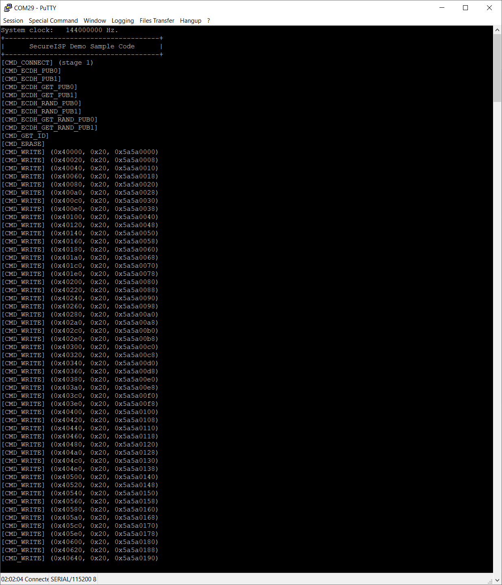

# Secure ISP 實作分析與指令說明

本文件說明 Secure ISP 的運作流程、安全機制以及支援的指令集。

> **本文件由 AI 自動生成，內容僅供參考。**  
> * 請務必驗證所有技術細節與程式碼的正確性
> * 安全性相關實作（如加密演算法、金鑰管理）需進行完整測試

## 1. Secure ISP 流程分析

Secure ISP 的執行流程主要分為三個階段：

1.  **連線階段 (Stage 1)**:
    *   Host 發送 `CMD_CONNECT` (0x80) 指令。
    *   Device 回應並確認連線。
    *   此階段尚未加密，主要用於確認裝置是否在線。

2.  **金鑰交換階段 (Stage 2)**:
    *   使用 **ECDH (Elliptic Curve Diffie-Hellman)** 演算法進行金鑰交換。
    *   雙方交換 Public Key (`CMD_ECDH_PUB0`, `CMD_ECDH_PUB1` 等)。
    *   Host 與 Device 各自計算出 **Shared Key**。
    *   此階段確保後續通訊的加密金鑰只有 Host 與 Device 知道，且金鑰本身未在網路上傳輸。

3.  **加密通訊階段 (Stage 3)**:
    *   所有後續指令 (如 `CMD_WRITE`, `CMD_ERASE`) 皆透過 **AES-256** 加密傳輸。
    *   封包結構包含 IV (Initialization Vector)、加密 payload 與 Checksum。
    *   Device 收到封包後，先解密再執行指令，並將回應加密後回傳。

## 2. 通訊握手與加密機制

*   **握手 (Handshake)**:
    *   透過 ECDH 協議 (Curve P-256)，雙方交換公鑰。
    *   Host 生成隨機私鑰與公鑰，傳送公鑰給 Device。
    *   Device 生成隨機私鑰與公鑰，傳送公鑰給 Host。
    *   雙方利用對方的公鑰與自己的私鑰計算出相同的 Shared Secret。
*   **加密 (Encryption)**:
    *   使用 **AES-256** 演算法。
    *   運作模式為 **CFB (Cipher Feedback)** 模式，適合串流加密。
*   **完整性 (Integrity)**:
    *   封包包含 Checksum 或 CRC 驗證，確保資料在傳輸過程中未被竄改。

## 3. 初始向量 (IV) 的作用

*   **用途**:
    *   IV 用於 AES-CFB 加密模式的隨機化。
    *   確保即使傳送相同的明文 (Plaintext)，每次加密後的密文 (Ciphertext) 也會不同，防止模式分析。
*   **安全性**:
    *   IV **不需要保密**，可以明文傳送。
    *   通訊的安全性完全依賴於 Shared Key 的保密性。
*   **更新機制**:
    *   系統支援 `CMD_GET_RAND_IV` 與 `CMD_SET_RAND_IV` 指令。
    *   每次新的通訊 session 或特定操作可更新 IV，以防止重放攻擊 (Replay Attack)。

## 4. 支援指令列表

以下表格總結了定義在 `CommandHandler.h` 並在 `CommandHandler.c` 中實作的 Secure ISP 指令。

### 1. 連線與握手階段 (Stage 1 & 2)

| Command ID | 名稱 | 描述 | 參數/備註 |
| :--- | :--- | :--- | :--- |
| `0x80` | `CMD_CONNECT` | 建立連線 | 回傳 Device ID (PDID) 與初始向量 (IV)。 |
| `0x8E` | `CMD_DISCONNECT` | 斷開連線 | 結束目前的 ISP Session。 |
| `0x8000` | `CMD_RESYNC` | 重新同步 | 重置連線狀態，清除所有 Key 與 IV。 |
| `0x8600` | `CMD_ECDH_PUB0` | 接收 Server 公鑰 (Part 0) | 接收 PC 端 ECC 公鑰的前半部。 |
| `0x8601` | `CMD_ECDH_PUB1` | 接收 Server 公鑰 (Part 1) | 接收後半部，並觸發生成第 1 組 ECDH 共享金鑰。 |
| `0x8602` | `CMD_ECDH_GET_PUB0` | 讀取 Client 公鑰 (Part 0) | 回傳 Device 端 ECC 公鑰的前半部 (加密)。 |
| `0x8603` | `CMD_ECDH_GET_PUB1` | 讀取 Client 公鑰 (Part 1) | 回傳 Device 端 ECC 公鑰的後半部 (加密)。 |
| `0x8604` | `CMD_ECDH_RAND_PUB0` | 接收隨機 Server 公鑰 (Part 0) | 接收 PC 端臨時隨機公鑰的前半部 (加密)。 |
| `0x8605` | `CMD_ECDH_RAND_PUB1` | 接收隨機 Server 公鑰 (Part 1) | 接收後半部 (加密)。 |
| `0x8606` | `CMD_ECDH_GET_RAND_PUB0` | 讀取隨機 Client 公鑰 (Part 0) | 生成並回傳 Device 臨時隨機公鑰的前半部 (加密)。 |
| `0x8607` | `CMD_ECDH_GET_RAND_PUB1` | 讀取隨機 Client 公鑰 (Part 1) | 回傳後半部，並切換至第 2 組 ECDH 共享金鑰 (加密)。 |

### 2. 一般操作指令 (Stage 3)

| Command ID | 名稱 | 描述 | 參數/備註 |
| :--- | :--- | :--- | :--- |
| `0x81` | `CMD_RESET` | 重置系統 | `0`: Chip Reset, `1`: System Reset, `2`: CPU Reset。 |
| `0x82` | `CMD_READ_CONFIG` | 讀取配置 | 讀取 User Configuration (CFG0, CFG3 等) 與 XOM 狀態。 |
| `0x83` | `CMD_WRITE` | 寫入 Flash | 寫入指定位址的 Flash 資料。 |
| `0x84` | `CMD_ERASE` | 清除 Flash | 清除指定位址與頁數的 Flash。 |
| `0x85` | `CMD_GET_ID` | 讀取 ID 資訊 | 讀取 PDID, UID, UCID, CID。 |
| `0x8F` | `CMD_GET_VERSION` | 讀取版本 | 讀取 Secure ISP Library 版本 (`LIB_VERSION`)。 |
| `0x8300` | `CMD_SET_MASS_WRITE` | 設定大量寫入 | 設定大量寫入的起始位址與總長度。 |
| `0x8301` | `CMD_MASS_WRITE` | 執行大量寫入 | 連續寫入資料封包 (最大 48 bytes/packet)。 |
| `0x8F00` | `CMD_EXEC_VENDOR_FUNC` | 執行廠商自定義函式 | 呼叫 `Exec_VendorFunction` 處理客製化指令 (如 `0x1000`, `0x2000`)。 |

### 3. 進階安全與特殊指令 (Stage 3)

| Command ID | 名稱 | 描述 | 參數/備註 |
| :--- | :--- | :--- | :--- |
| `0x8608` | `CMD_GET_RAND_IV` | 取得隨機 IV | 請求 Device 生成並回傳新的隨機 IV。 |
| `0x8609` | `CMD_SET_RAND_IV` | 設定隨機 IV | 設定新的 IV 用於後續加密。 |
| `0x8700` | `CMD_IDENTIFY_SERVER` | 伺服器身分驗證 | (程式碼中未見具體實作細節，可能保留擴充)。 |
| `0x8888` | `CMD_IS_MASKED` | 檢查遮罩狀態 | 用於回報某些操作被安全遮罩 (Mask) 禁止。 |

### 4. 回傳狀態碼 (Response Status)

| Status ID | 名稱 | 描述 |
| :--- | :--- | :--- |
| `0x00` | `STS_OK` | 操作成功。 |
| `0x7F` | `ERR_CMD_CONNECT` | 連線錯誤。 |
| `0x7E` | `ERR_CMD_INVALID` | 無效的指令 ID。 |
| `0x7D` | `ERR_CMD_CHECKSUM` | 封包 Checksum (CRC32/CCITT) 錯誤。 |
| `0x7B` | `ERR_ISP_WRITE` | Flash 寫入失敗 (Verify 錯誤)。 |
| `0x7A` | `ERR_INVALID_ADDRESS` | 無效的記憶體位址 (非 4-byte 對齊或長度錯誤)。 |
| `0x79` | `ERR_OVER_RANGE` | 存取範圍超出 APROM/LDROM 邊界。 |
| `0x78` | `ERR_PAGE_ALIGN` | 清除操作位址未對齊 Page 邊界。 |
| `0x77` | `ERR_ISP_ERASE` | Flash 清除失敗。 |
| `0x72` | `ERR_CMD_KEY_EXCHANGE` | 金鑰交換過程錯誤。 |
| `0x6F` | `ERR_TIMEOUT` | 操作逾時。 |

## 測試輸出
