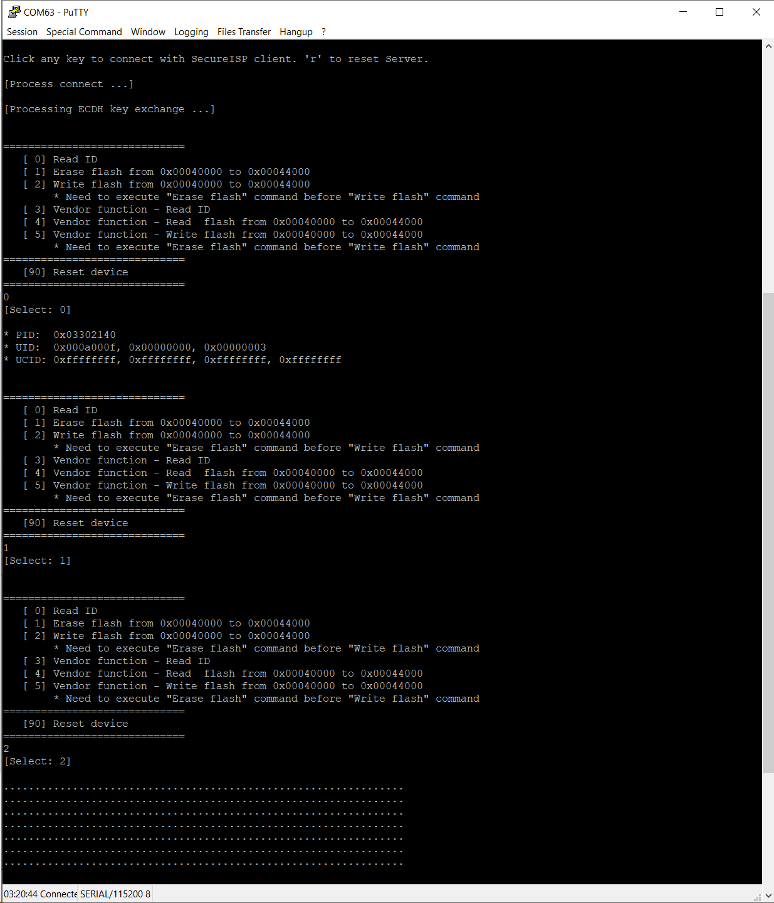

# USB Host Secure ISP 範例程式

> **本文件由 AI 自動生成，內容僅供參考。**  
> * 請務必驗證所有技術細節與程式碼的正確性
> * 安全性相關實作（如加密演算法、金鑰管理）需進行完整測試

## 描述
本範例程式碼示範如何使用 NuMicro USB Host HID 驅動程式實作 Secure ISP Host。此程式設計用於配合 `SecureISPDemo` 範例程式 (Device 端) 一起運作。

## 專案結構
*   `main.c`: 系統初始化、USB Host 核心初始化以及裝置偵測迴圈。
*   `ProcessCommand.c`: 實作 Secure ISP 協議，包含連線、ECDH 金鑰交換、AES 加解密以及指令處理。
*   `user_hid_core.c`: 客製化的 USB Host HID 驅動程式。

## 運作流程
1.  **初始化**: 設定系統時脈與 USB Host 堆疊。
2.  **裝置偵測**: 等待 USB HID 裝置連接。
3.  **Secure ISP 握手**:
    *   **第一階段 (連線)**: 發送 `CMD_CONNECT` 確認裝置在線。
    *   **第二階段 (金鑰交換)**: 執行 ECDH (橢圓曲線 Diffie-Hellman) 以產生共享密鑰。
    *   **第三階段 (加密通訊)**: 進入指令迴圈，所有資料皆使用 AES-256 加密。
4.  **指令選單**:
    *   `[0] Read ID`: 讀取目標裝置 ID。
    *   `[1] Erase Flash`: 清除指定 Flash 區域。
    *   `[2] Write Flash`: 寫入資料至 Flash。
    *   `[3-5] Vendor Function`: 執行自定義廠商指令。
    *   `[90] Reset Device`: 重置目標裝置。

## 實作注意事項
*   **USB 通訊**: 使用 HID Interrupt In/Out 端點。
*   **安全性**:
    *   **ECDH**: 使用 Curve P-256 進行金鑰交換。
    *   **AES-256**: 使用 CFB 模式進行封包加密。
    *   **完整性**: 使用 Checksum/CRC 驗證封包。
*   **同步等待**: 目前實作使用 Busy Loop 等待裝置回應。建議在正式產品中加入 Timeout 機制。

## 測試輸出

